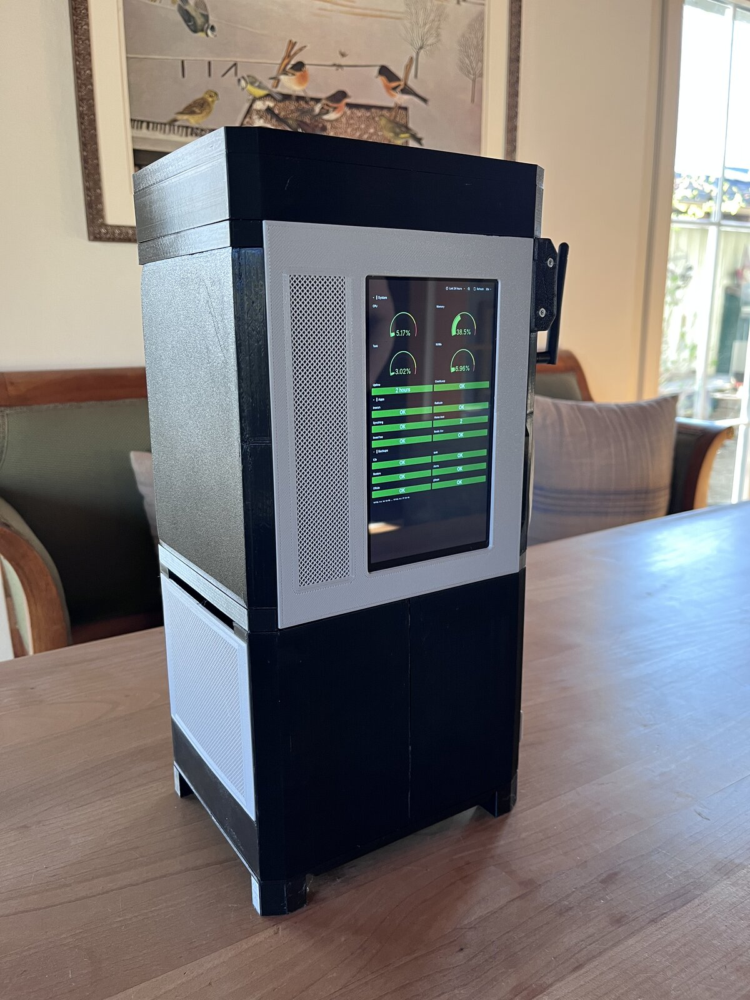

A self-hosted NAS server managed entirely as Infrastructure-as-Code. The system runs Ubuntu Server
with K3s (lightweight Kubernetes) and uses FluxCD for GitOps-based continuous deployment.
The 3D-printed case integrates a 7" touchscreen kiosk display showing a live Grafana dashboard.
<!-- more -->

## Hardware

The server is built on a Topton Q670 board with an Intel i5-12400 processor. Storage consists of
four 4TB Seagate IronWolf drives in a ZFS RAIDZ1 pool for bulk data (11TB usable) and a 1TB
FireCuda 530R NVMe SSD for the Kubernetes system and fast workloads.

## Architecture

The entire infrastructure is defined in code and version-controlled with Git:

- **Provisioning**: Ansible roles handle OS hardening, ZFS configuration, K3s installation, and system services
- **Orchestration**: K3s with Cilium CNI for eBPF-based networking
- **GitOps**: FluxCD watches the repository and automatically reconciles the cluster state
- **Networking**: Traefik for HTTPS ingress via Gateway API, MetalLB for LoadBalancer IPs, Netbird for VPN mesh access
- **TLS**: cert-manager with Let's Encrypt certificates via DNS-01 challenges
- **Secrets**: SOPS encryption (GPG + age) for secrets stored in Git

## Development Workflow

Changes follow a strict promotion process. A local test VM (QEMU with passt networking) watches
the main branch for automatic deployment. After verification, changes are promoted to production
via semver tags. This ensures production only runs validated configurations.

## Self-Hosted Services

The NAS hosts several services for personal use, including photo management, file synchronization,
calendar and contacts (CalDAV/CardDAV), inventory management, smart home automation, and monitoring
dashboards.

## Backup Strategy

Backups run four times daily using restic, covering both the NVMe infrastructure and HDD data pools.
ZFS snapshots provide additional local protection. An offsite Raspberry Pi CM5 pulls backup data
over VPN using a secure SFTP chroot with read-only access, providing air-gapped protection.

The offsite backup currently runs on a CM5 with a USB-to-SATA cable — functional but inelegant.
This setup directly motivated the [Granit](/projects/hardware/granit/) project: a purpose-built open hardware
carrier board with native PCIe SATA, replacing the USB bottleneck with a proper solution.

## Hardware Lesson Learned: The Intel I226 Network Card

The single most important lesson from this build: **avoid the Intel I226-V 2.5GbE network
controller**. The onboard I226 had a hardware defect with PCIe Active State Power Management (ASPM)
that caused the system to hang on every reboot. No kernel parameter or firmware update fixed it
reliably.

After months of workarounds (`pcie_aspm=off`, aliasing reboot to poweroff, masking
`systemd-networkd-wait-online`), the solution was simple: a $15 Realtek RTL8125B 2.5GbE PCIe card.
Plugged it in, updated netplan, removed all workarounds. Zero issues since.

If you're building a home server on a Topton or similar mini-ITX board with an Intel I226, budget
for a replacement NIC from the start. The I226 reboot issue is well-documented across NAS and
firewall communities, and Intel has not released a definitive fix.
